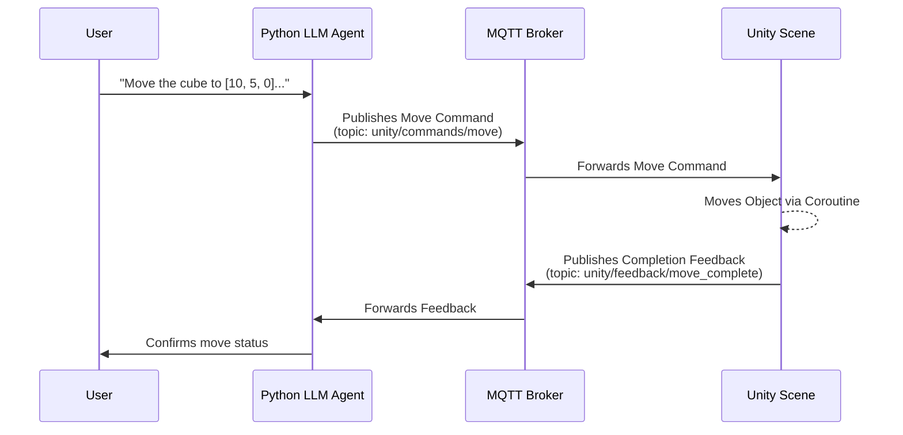

# Controlling Unity3D Objects with a Natural Language Agent

This project demonstrates how to control a 3D object in a Unity scene using natural language commands processed by a Large Language Model (LLM). The system integrates a Python-based LLM agent, a Go-based MQTT broker, and a C# script in Unity to create a seamless command-and-control pipeline.

This repository contains the accompanying code for an article on this topic, designed for a mid-level technical audience familiar with Unity, Python, and basic networking concepts.

## Architecture Overview

The system is composed of three main components that communicate via an MQTT message broker. This decoupled architecture allows each component to be developed, tested, and run independently.



### Core Components

1.  **LLM Agent (`unity3d_agent/`)**: A Python application using the [LlamaIndex](https://www.llamaindex.ai/) framework to create a function-calling agent. It interprets natural language commands from the user, translates them into structured JSON commands, and sends them to the MQTT broker. It also includes a tool to check the status of a requested movement.

2.  **MQTT Broker (`mqtt_server/`)**: A lightweight MQTT server written in Go. It acts as the central message bus, relaying commands from the LLM agent to the Unity client and forwarding completion feedback back to the agent. It includes a custom hook that logs all move commands, which is useful for debugging.

3.  **Unity Client (`WWTR AR/Assets/Scripts/`)**: A C# script (`ObjectMover.cs`) within a Unity project. It connects to the MQTT broker, subscribes to move command topics, and executes the commands by manipulating `GameObject` transforms in the scene. Once a movement is complete, it publishes a feedback message back to the broker.

## Prerequisites

Before you begin, ensure you have the following software installed:

-   **Unity Hub** and **Unity Editor** (2021.3 LTS or newer is recommended).
-   **Go** (version 1.18 or newer).
-   **Python** (version 3.9 or newer).
-   **A Local LLM Server**: The Python agent is configured to connect to a local LLM that exposes an OpenAI-compatible API endpoint. Recommended options include:
    -   **LM Studio**: A user-friendly GUI for running various open-source models.
    -   **LlamaEdge**: A high-performance inference engine.
    -   **llama.cpp**: Run in server mode.

    The agent expects the server to be running at `http://127.0.0.1:8080/v1`.

## Setup and Running the Demo

Follow these steps to get all components up and running. It's recommended to use a separate terminal for each component to monitor its output.

### Step 1: Start the MQTT Broker

1.  Open a terminal and navigate to the `mqtt_server` directory:
    ```bash
    cd mqtt_server
    ```
2.  Install the Go dependencies:
    ```bash
    go mod tidy
    ```
3.  Run the server:
    ```bash
    go run main.go
    ```
4.  You should see output indicating the server has started on port `1883`.

    ```
    INFO server starting
    INFO listener opened
    MQTT Server started on :1883
    ```

### Step 2: Configure and Run the Unity Project

1.  Open the `WWTR AR` project located in the repository's root using Unity Hub.
2.  Unity may take some time to import the project and its assets. The required packages (`M2Mqtt` for MQTT and `Newtonsoft.Json` for JSON serialization) are already included in the `Assets` folder.
3.  In the Unity Editor, open the sample scene (e.g., from `Assets/Scenes/`).
4.  Create a simple 3D object for testing. Go to **GameObject > 3D Object > Cube**. Select the new cube and, in the Inspector, rename it to **`Cube`**.
5.  Create an empty GameObject to act as our controller. Go to **GameObject > Create Empty**. Name it `MqttController`.
6.  Attach the `ObjectMover.cs` script to the `MqttController` GameObject. You can find the script in `Assets/Scripts`.
7.  With `MqttController` selected, look at the Inspector window. You will see the `Object Mover` script component.
    -   Drag the **`Cube`** GameObject from the Hierarchy panel into the **`Controllable Object`** field of the script.
    -   Ensure the MQTT broker settings are correct:
        -   `Broker Address`: `127.0.0.1` (or `localhost`)
        -   `Broker Port`: `1883`
        -   `Auto Connect`: Checked
8.  Press the **Play** button at the top of the Unity Editor.
9.  Check the Unity Console (**Window > General > Console**) for messages confirming a successful connection to the MQTT broker.

    ```
    MQTT Connected.
    Subscribed to topic: unity/commands/move
    ```

### Step 3: Launch the LLM Agent

1.  **Important**: Make sure your local LLM server (LM Studio, etc.) is running and accessible at `http://127.0.0.1:8080/v1`.
2.  Open a new terminal and navigate to the `unity3d_agent` directory.
3.  It's highly recommended to use a Python virtual environment:
    ```bash
    python3 -m venv venv
    source venv/bin/activate 
    # On Windows, use `venv\Scripts\activate`
    ```
4.  Install the required Python packages:
    ```bash
    pip install llama-index paho-mqtt openai
    ```
5.  Run the agent script:
    ```bash
    python server.py
    ```
6.  You should see a confirmation that the agent is connected to the MQTT broker and ready to accept commands.

### Step 4: Interact with the System

Now with all three components running, you can issue commands:

1.  Focus on the terminal where the LLM agent (`server.py`) is running.
2.  Type a command in natural language and press Enter. For example:
    -   `Move Cube to [0.0, 5.0, 0.0] over 3 seconds.`
    -   `Can you move the Cube to a position of -5, 2, 10? Make it take 5 seconds.`
    -   `initiate a move for the Cube to 0,0,0`

3.  Observe the output in all three terminals. You will see the agent processing the command, the MQTT broker logging the message, and the cube moving smoothly in the Unity scene. The agent will then periodically check for and confirm the move's completion.

## How It Works: A Deeper Dive

-   **Command & Control Flow**: When you type a command, the LlamaIndex agent uses its LLM to understand your intent. It determines that it needs to use the `initiate_object_move_3d` tool. The agent extracts the necessary parameters (`object_name`, `target_position`, `duration`) from your text.

-   **MQTT Message Protocol**: The agent's tool constructs a JSON payload and publishes it to the `unity/commands/move` topic. A unique `request_id` is generated for each command to track its execution.

    *Command Payload Example:*
    ```json
    {
      "object_name": "Cube",
      "target_position": [0.0, 5.0, 0.0],
      "duration": 3.0,
      "request_id": "a1b2c3d4-e5f6-..."
    }
    ```

-   **Execution in Unity**: The `ObjectMover.cs` script, subscribed to this topic, receives the message. It deserializes the JSON and starts a `Coroutine`. This coroutine uses `Vector3.Lerp` to smoothly interpolate the object's position from its start to the target over the specified duration, ensuring the movement doesn't block the main game loop.

-   **The Feedback Loop**: Once the coroutine completes, the script constructs a `MoveCompletionFeedback` JSON payload, including the original `request_id`, and publishes it to the `unity/feedback/move_complete` topic. This confirms that the action was successfully performed.

    *Feedback Payload Example:*
    ```json
    {
      "object_name": "Cube",
      "final_position": [0.0, 5.0, 0.0],
      "status": "success",
      "timestamp": "2023-10-27T10:00:00Z",
      "request_id": "a1b2c3d4-e5f6-..."
    }
    ```

-   **State Tracking**: The Python agent receives this feedback. The `server.py` script demonstrates how the agent can poll for completion using the `check_move_status` tool and the `request_id`. This enables building more complex, sequential tasks (e.g., "move here, then move there").

## Customization and Extension

This project is a foundation that you can extend in many ways:

-   **Add More Tools**: Create new functions in `server.py` and `ObjectMover.cs` to control other properties like rotation, scale, or color.
-   **Control More Objects**: Add multiple objects to your scene and attach the `ObjectMover.cs` script to each. The script already filters commands by `object_name`, so the agent can control them independently.
-   **Enhance the Agent's Prompt**: Modify the system prompt in `unity3d_agent/server.py` to give the agent more context about the scene, its capabilities, or a specific personality. 